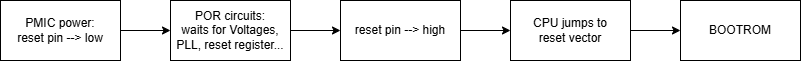

## 🧱 Power-On Reset and the Boot ROM

### 🔌 Power-On Reset (POR)

Suppose that there is a SoC which would get some power from PMIC.  
If SoC gets power, a particular circuit will be operated for reset.  
The name of circuit is **Power-On Reset (POR).**

***

### ⬇️ Reset Pin Behavior

If SoC starts to get some power, the **reset pin** would be **low (active)** state.  
Reset pin is some kind of signal, and if the state of reset pin changes to high,  
CPU jumps to **reset vector** immediately.  
Reset vector has the starting address of **boot ROM code**.

***

### 🧠 Why POR Circuit is Needed

The reason why there is a POR circuit is for initializing all digital blocks like CPU and memory controller.  
There are many important things for operating SoC — like **registers, clocks, and voltages.**

To explain POR circuit simply, this circuit **waits for stable operating conditions** for everything mentioned in the previous line.

***

For example:

- POR circuit waits for reset of all previously written registers.
- It also waits for **clock stabilization**.

SoC operation starts with **XTAL**, which is a low but stable clock oscillator.  
POR waits until **lock in PLL (Phase-Locked Loop)**.  
PLL is a kind of **frequency multiplier**.  
This will be locked after stabilization.  
So in order to operate normally, POR checks the **lock signal from PLL**.

***

### ✅ Exit of POR and Transition to BOOTROM

Once again, POR looks at the internal state of SoC to ensure stable operation.  
And if **PMIC changes the reset pin to HIGH**, POR **exits the reset state**.  
PMIC changes the reset pin **when SoC voltages are stable**.